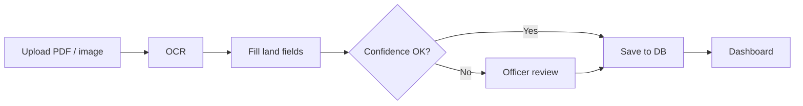

# LandStack

**Intelligent Land Record Digitization and Validation System**  
Smart India Hackathon (SIH) project — basic working prototype by **6 September 2026**.

LandStack is an AI-assisted platform that extracts structured land-record fields from scanned documents, PDFs, maps, and handwritten pages, then validates them with confidence scores and a human review step.

---

## Problem

Land records underpin ownership, taxation, acquisition, disputes, and infrastructure planning. A large share of India’s historical records still exist as handwritten registers, scanned pages, maps, cadastral sheets, and legacy PDFs.

Manual digitization is slow and error-prone because of:

- Poor image quality, faded or damaged pages
- Inconsistent formats across offices
- Multiple Indian languages and handwritten annotations
- No reliable, standardized digital database for ownership checks and citizen services

This raises cost, creates inconsistencies, and blocks integration with modern land information systems.

---

## Goal (this prototype)

Deliver a **basic working system** that can:

1. Accept a land-record document (image or PDF)
2. Run OCR / extraction into predefined fields
3. Score confidence per field and flag uncertain values
4. Let an officer verify and correct low-confidence records
5. Store **5 curated land records** in the database (sample data to be provided)
6. Show a simple dashboard (processed count, validation status, pending reviews)

Full-scale multilingual production, live DILRMP/LRMS/GIS integrations, and continuous ML retraining are **out of scope** for this deadline. The prototype will use mock/stub APIs so those integrations can be added later.

---

## Target fields

Extracted and stored data is classified into:

| Field | Description |
| --- | --- |
| Landowner details | Name and related owner information |
| Survey number | Survey / plot survey identifier |
| Khasra number | Khasra identifier |
| Khata number | Khata / account identifier |
| Plot area | Area of the plot |
| Village | Village name |
| Tehsil | Tehsil / taluka |
| District | District |
| Land classification | Type / class of land |
| Ownership details | Nature of ownership |
| Mutation records | Mutation / transfer history (if present) |
| Registration information | Registration metadata (if present) |

---

## Scope of study

| Area | In this prototype | Later / full SIH vision |
| --- | --- | --- |
| Document ingest | Upload scanned images and PDFs | Historical bulk ingest, maps, cadastral sheets |
| OCR / CV | Printed + simple handwritten text (primary language + one extra if time) | Major Indian languages, damaged/faded pages |
| NLP / classification | Map OCR text into the fields above | Deeper entity linking across mutations |
| Validation | Business-rule checks, duplicate detection on the 5 records | Cross-database verification vs LRMS / DILRMP |
| Confidence | Per-field score; auto-flag low-confidence fields | Adaptive thresholds from production traffic |
| Human workflow | Verify / edit / approve queue | Role-based multi-level audit |
| Learning loop | Store corrections for future training | Automatic model improvement |
| Integrations | Stub APIs for LRMS, DILRMP, GIS | Live government systems |
| Security | Login + roles (admin / officer / viewer) | Full RBAC, audit trail, secure repository |
| Dashboard | Counts, accuracy, pending cases, errors | State- and district-wise progress maps |

---

## Expected solution (prototype vs full platform)

The SIH brief asks for an intelligent platform that:

- Recognizes multilingual printed and handwritten documents
- Extracts structured land-record information
- Classifies data into predefined fields
- Validates with rules, cross-checks, and duplicate detection
- Scores confidence and routes uncertain fields to humans
- Improves over time from corrections
- Integrates with LRMS, DILRMP, GIS, and cadastral maps
- Keeps a secure document store with metadata and audit trails
- Exposes dashboards and APIs for government systems
- Enforces role-based access to sensitive records

**LandStack’s first delivery** implements the core loop: **upload → extract → validate → review → store**, plus a dashboard and placeholder integration APIs, using **five database records** as the working dataset.

---

## Sample database (5 records)

Five land records will be loaded as the demonstration dataset. Exact values will be added when provided.

Until then the schema is ready for those rows (same fields as the table above, plus document metadata, extraction confidence, validation status, and audit timestamps).

---

## High-level architecture 
## Simple architecture
Three layers only — 
```
[Officer UI]  →  [API]  →  [OCR + field extraction]
                    ↓
              [Validation + confidence]
                    ↓
         [Review queue]  →  [Land records DB (5 samples)]
                    ↓
              [Dashboard + stub LRMS/GIS APIs]
┌─────────────────────────────────────────────────────────┐
│  UI  (officer)                                          │
│  Upload document · Dashboard · Review / correct fields  │
└──────────────────────────┬──────────────────────────────┘
                           │ HTTP
┌──────────────────────────▼──────────────────────────────┐
│  API  (backend)                                         │
│  1. Save file                                           │
│  2. OCR + field extraction                              │
│  3. Validation + confidence score                       │
│  4. If score low → review queue, else save              │
└─────────────┬─────────────────────────────┬─────────────┘
              │                             │
              ▼                             ▼
┌─────────────────────────┐    ┌─────────────────────────┐
│  SQLite DB              │    │  Stub integrations      │
│  5 land records         │    │  LRMS / DILRMP / GIS    │
│  documents + audit log  │    │  (fake responses)       │
└─────────────────────────┘    └─────────────────────────┘
```
### How one document moves

| Layer | What it does | Simple choice |
| --- | --- | --- |
| **UI** | Upload, see dashboard, edit low-confidence fields | Web pages (HTML or React) |
| **API** | Run extract → validate → save | Python FastAPI or Flask |
| **AI** | Read text, map to khasra / khata / owner / village… | Tesseract OCR + field rules (no heavy ML for v1) |
| **DB** | Store 5 sample records + new extractions | SQLite |
| **Stubs** | Pretend LRMS / GIS exist | Dummy JSON APIs |
### Folder layout (this repo)
```
LandStack/
  README.md
  app/
    main.py              # API: upload, extract, review, dashboard stats
    extract.py           # OCR + map text to land fields
    validate.py          # rules, duplicates, confidence
    stubs.py             # fake LRMS / DILRMP / GIS
  data/
    landstack.db         # SQLite (5 seed records)
    uploads/             # scanned files
  web/
    index.html           # upload + dashboard + review
```
**Login / roles** can stay minimal (one officer user) for the prototype. Live government databases are not required — stubs are enough.
---


## Timeline

| Date | Target |
| --- | --- |
| Now | Problem statement captured in this README |
| Next | App skeleton, schema, and 5 records (when provided) |
| By 6 Sep 2026 | Basic upload, extract, validate, review, and dashboard working |

---

## Status

Early prototype. Code and sample records will be added in this repository.

## License

To be decided by the team.
